## Spring Shell

#### how to run?
```shell
java -jar target/spring-shell-0.0.1-SNAPSHOT.jar
```

#### ! NOTE
- After add spring shell dependency, don't forget to add dependency below for use shell on your windows cmd
```xml

<dependency>
    <groupId>org.jline</groupId>
    <artifactId>jline-terminal-jna</artifactId>
    <version>3.23.0</version>
</dependency>
```


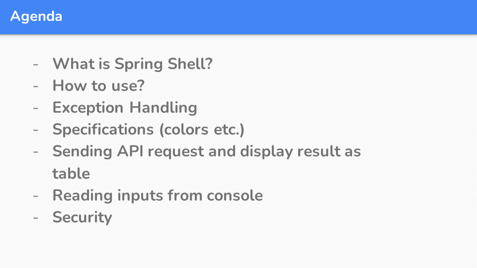
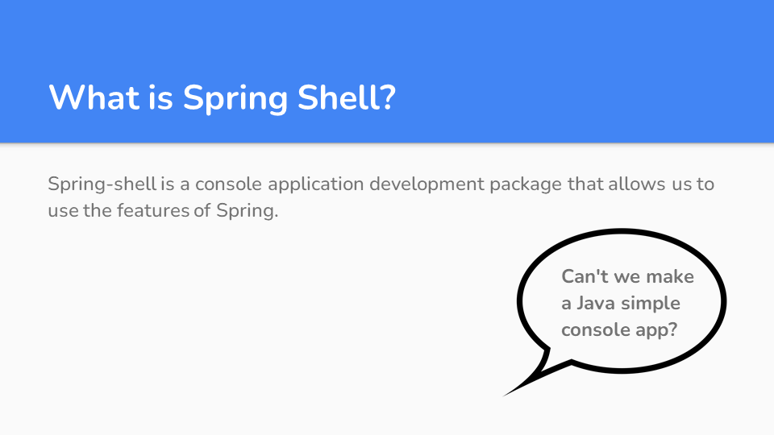
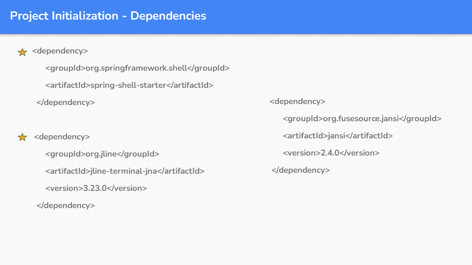
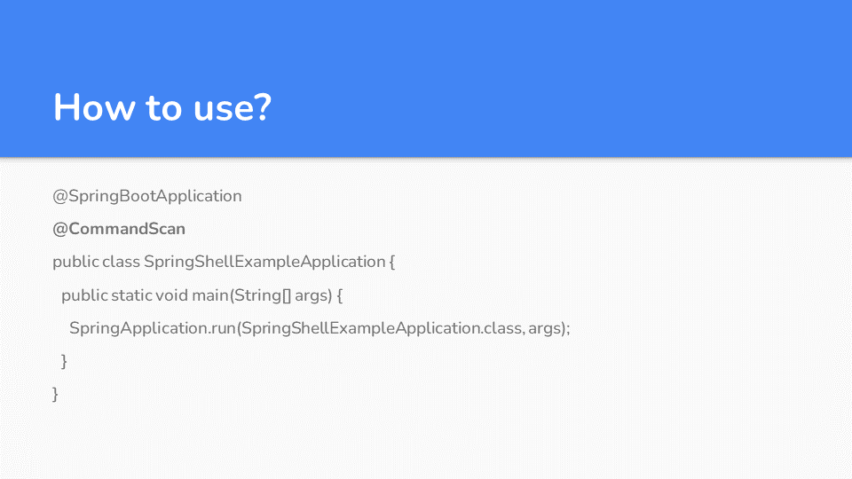
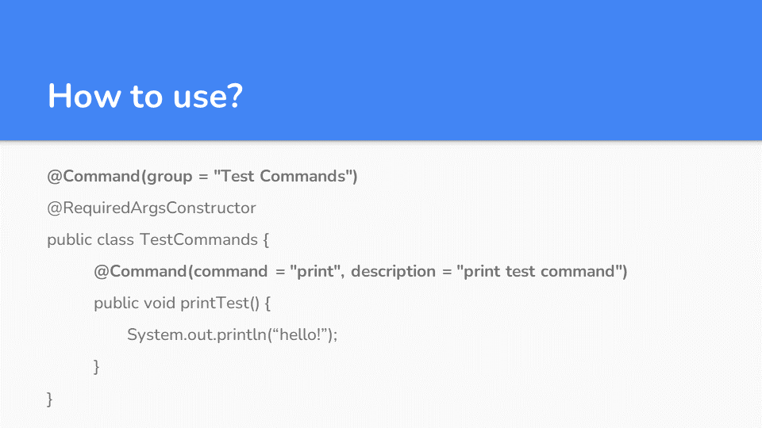
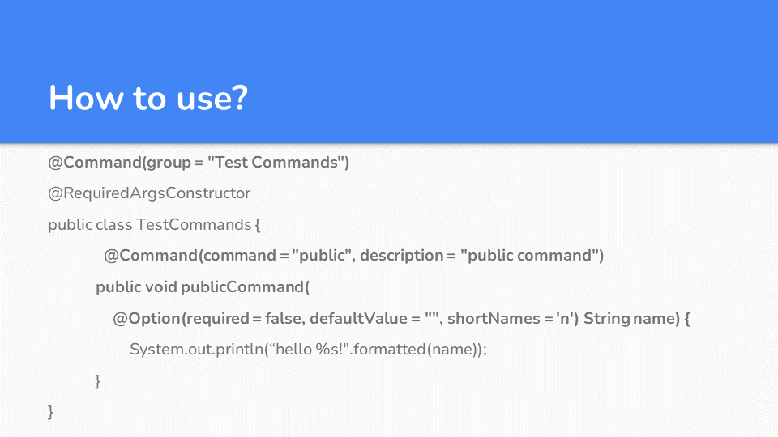
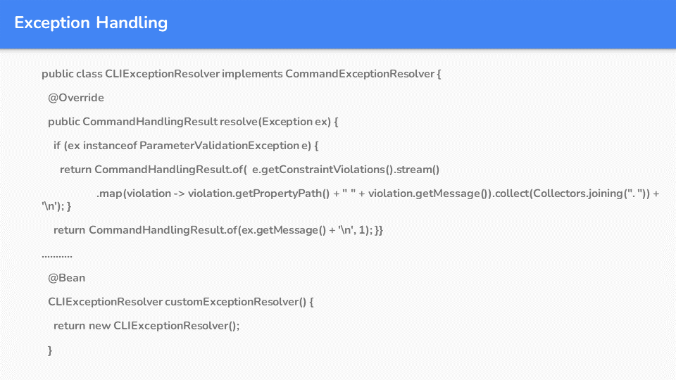
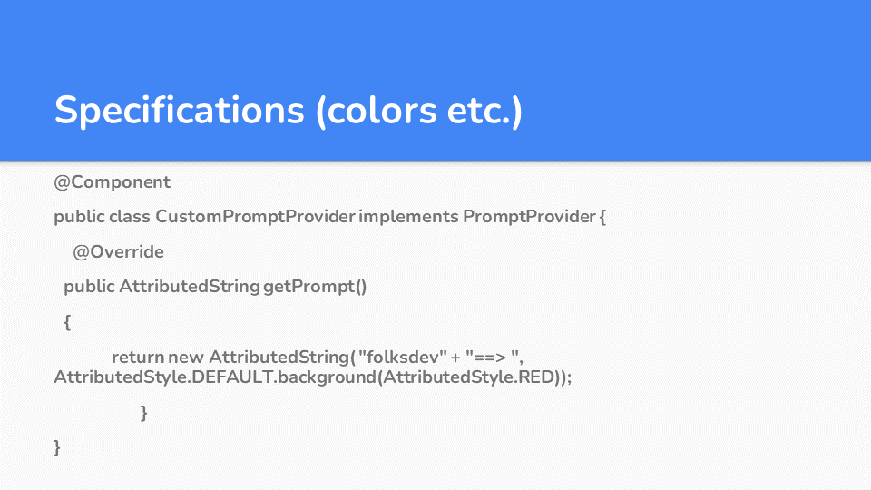
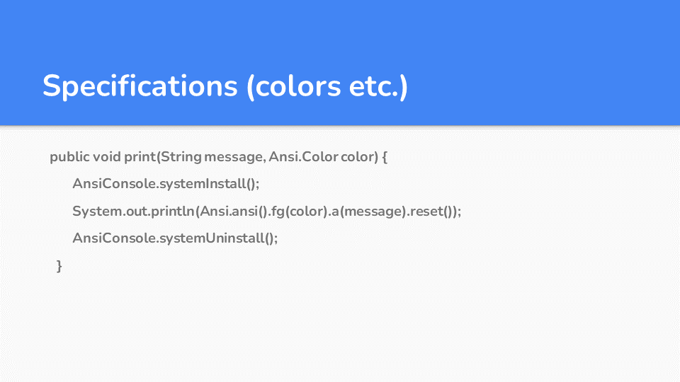
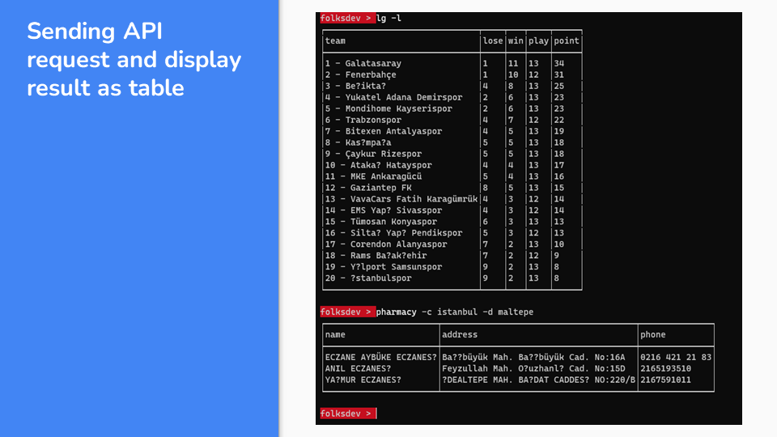
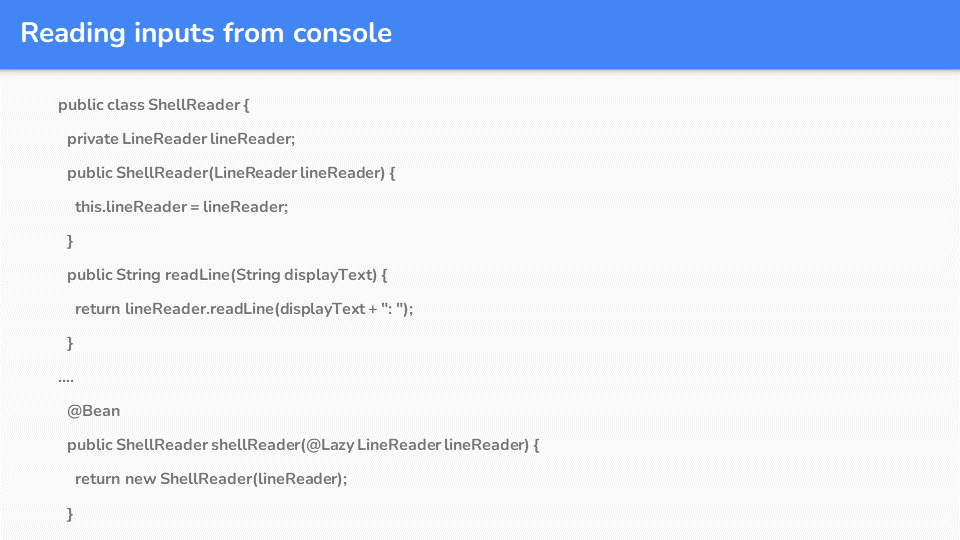
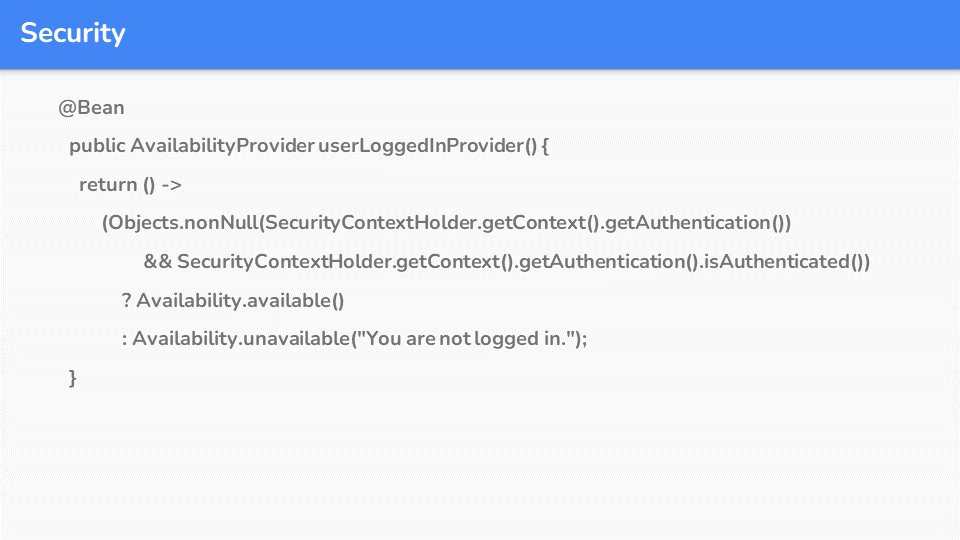
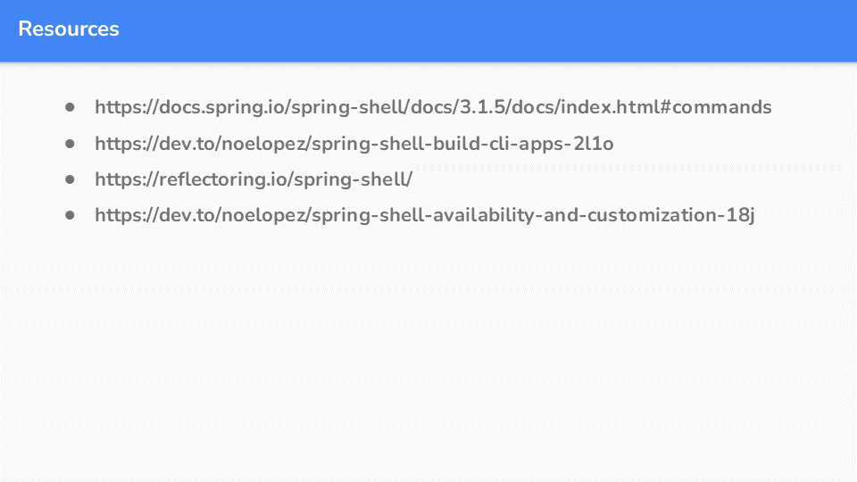


### resources

[https://docs.spring.io/spring-shell/docs/3.1.5/docs/index.html#commands](https://docs.spring.io/spring-shell/docs/3.1.5/docs/index.html#commands)

[https://dev.to/noelopez/spring-shell-build-cli-apps-2l1o](https://dev.to/noelopez/spring-shell-build-cli-apps-2l1o)

[https://reflectoring.io/spring-shell/](https://reflectoring.io/spring-shell/)

[https://dev.to/noelopez/spring-shell-availability-and-customization-18j](https://dev.to/noelopez/spring-shell-availability-and-customization-18j)
